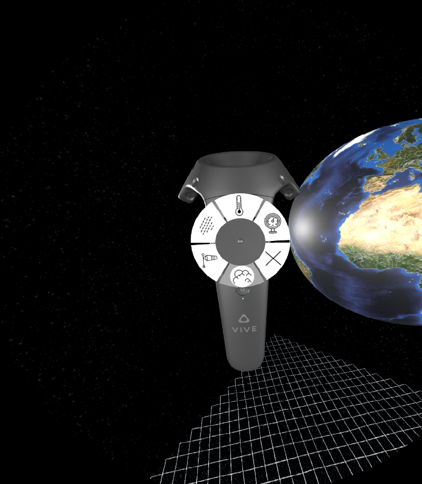
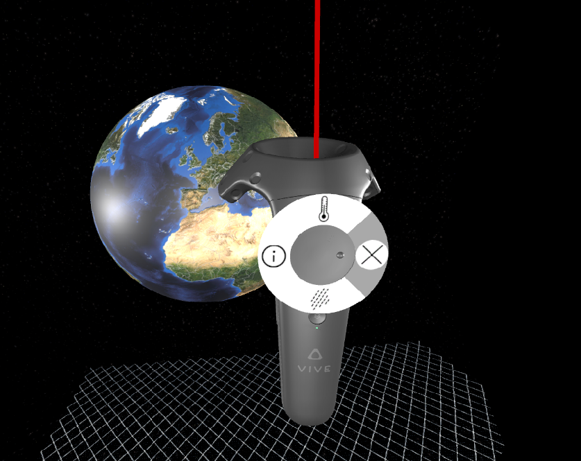

# User Documentation
## Installation
Run GlobeVR.exe and enjoy the virtual earth. Make sure SteamVR is running and the HMD is recognized correctly.

## Usage
### Left controller
This controller is the overlay controller. Using it you can create overlays containing the selected information.

(Image taken from https://www.vive.com/uploadedimages/common/ditahowto/site_us/vive/GUID-2D5454B7-1225-449C-B5E5-50A5EA4184D6-web.png)

__Button 2__: Radial menu. When touching the Touchpad a radial menu appears. You can select several information like global temperature, global precipitation, global wind speed or global barometric pressure. You can also delete the current shown overlay.

__Button 3__: Takes you to the Steam Overview Menu

### Right controller
This controller is the location specific controller. You can point at any location you want with a laser beam and show different types of information.

(Image taken from https://www.vive.com/uploadedimages/common/ditahowto/site_us/vive/GUID-2D5454B7-1225-449C-B5E5-50A5EA4184D6-web.png)

__Button 2__: Radial menu. When touching the Touchpad a radial menu appears. You can select different types on info screens you want to create. The infoscreen will display information influenced by the position of the laser pointer and the chosen data.

__Button 7__: The trigger button is used to rotate the earth. Point with the laser pointer to the globe and click the button to rotate.
